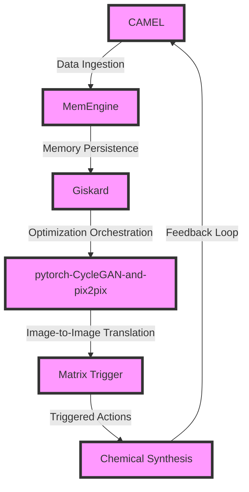

# Latency-Sensitive Chemical Synthesis Optimization Engine
> Orchestrating a symphony of molecular interactions to harmonize chemical synthesis workflows

## 🏗️ Technical Architecture & Multi-Agent Flow

The technical architecture of the Latency-Sensitive Chemical Synthesis Optimization Engine is a complex interplay of multiple agents, each with its own specialized function. CAMEL handles data ingestion, feeding into MemEngine for memory persistence. Giskard orchestrates the optimization process, leveraging the image-to-image translation capabilities of pytorch-CycleGAN-and-pix2pix. Matrix Trigger translates the optimized outputs into triggered actions, which are then executed in the chemical synthesis workflow. The feedback loop from the chemical synthesis workflow back to CAMEL ensures continuous improvement and refinement of the optimization process.

## 🔍 The Vertical Bottleneck: Chemical Synthesis Optimization
The chemical synthesis optimization problem is a deeply vertical challenge, characterized by intricate molecular interactions, complex reaction kinetics, and high-stakes mathematical and operational failures. The optimization of chemical synthesis workflows is a high-dimensional problem, involving the simultaneous consideration of multiple factors such as reaction conditions, reagent concentrations, and catalyst selection. The complexity of this problem is further exacerbated by the need to balance competing objectives, such as yield, purity, and cost. Traditional optimization approaches, such as linear programming and quadratic programming, are often insufficient to tackle the nuances of chemical synthesis optimization, leading to suboptimal solutions and reduced productivity.

The high-stakes nature of chemical synthesis optimization is evident in the potential consequences of suboptimal solutions. Inadequate optimization can result in reduced yields, decreased product quality, and increased waste generation, ultimately leading to significant economic and environmental costs. Furthermore, the complexity of chemical synthesis workflows often necessitates the involvement of multiple stakeholders, including chemists, engineers, and operators, each with their own specialized expertise and perspectives. The integration of these diverse perspectives and expertise is critical to the development of effective optimization solutions.

The technical friction associated with chemical synthesis optimization is multifaceted, involving challenges such as data quality, model uncertainty, and computational complexity. The availability and quality of data are critical factors in the development of effective optimization solutions, as they directly impact the accuracy and reliability of the optimization models. However, the collection and integration of relevant data are often hindered by issues such as data siloing, formatting inconsistencies, and measurement uncertainties. Moreover, the development of optimization models that accurately capture the complexities of chemical synthesis workflows is a significant challenge, requiring the integration of multiple disciplines, including chemistry, physics, and mathematics.

## 💡 The Solution: Latency-Sensitive Chemical Synthesis Optimization Engine
The Latency-Sensitive Chemical Synthesis Optimization Engine is a novel platform that orchestrates the interplay of CAMEL, MemEngine, Giskard, pytorch-CycleGAN-and-pix2pix, and Matrix Trigger to solve the chemical synthesis optimization problem. The platform leverages the strengths of each component to address the technical friction and high-stakes mathematical and operational failures associated with chemical synthesis optimization. CAMEL handles data ingestion, feeding into MemEngine for memory persistence, while Giskard orchestrates the optimization process, leveraging the image-to-image translation capabilities of pytorch-CycleGAN-and-pix2pix. Matrix Trigger translates the optimized outputs into triggered actions, which are then executed in the chemical synthesis workflow.

The agentic reasoning of the platform is based on a deep understanding of the chemical synthesis workflow, incorporating knowledge of reaction kinetics, thermodynamics, and molecular interactions. The platform's memory usage is optimized through the use of MemEngine, which enables the efficient storage and retrieval of large datasets. The vision/robotics integration is facilitated through the use of pytorch-CycleGAN-and-pix2pix, which enables the translation of optimized outputs into actionable insights.

## 🧩 Agentic Stack Deep-Dive
The agentic stack of the Latency-Sensitive Chemical Synthesis Optimization Engine is a complex interplay of multiple libraries and integrations. CAMEL provides a flexible framework for data ingestion, while MemEngine enables efficient memory persistence. Giskard orchestrates the optimization process, leveraging the strengths of pytorch-CycleGAN-and-pix2pix for image-to-image translation. Matrix Trigger translates the optimized outputs into triggered actions, which are then executed in the chemical synthesis workflow.

The integration of CAMEL, MemEngine, and Giskard is critical to the development of effective optimization solutions. CAMEL's data ingestion capabilities are complemented by MemEngine's memory persistence, enabling the efficient storage and retrieval of large datasets. Giskard's optimization orchestration is facilitated through the use of pytorch-CycleGAN-and-pix2pix, which enables the translation of optimized outputs into actionable insights. The use of Matrix Trigger enables the translation of optimized outputs into triggered actions, which are then executed in the chemical synthesis workflow.

## ✨ Capabilities & Features
* **Data Ingestion**: CAMEL provides a flexible framework for data ingestion, enabling the integration of diverse data sources and formats.
* **Memory Persistence**: MemEngine enables efficient memory persistence, facilitating the storage and retrieval of large datasets.
* **Optimization Orchestration**: Giskard orchestrates the optimization process, leveraging the strengths of pytorch-CycleGAN-and-pix2pix for image-to-image translation.
* **Image-to-Image Translation**: pytorch-CycleGAN-and-pix2pix enables the translation of optimized outputs into actionable insights.
* **Triggered Actions**: Matrix Trigger translates the optimized outputs into triggered actions, which are then executed in the chemical synthesis workflow.
* **Chemical Synthesis Workflow Integration**: The platform enables seamless integration with chemical synthesis workflows, facilitating the execution of optimized outputs.
* **Agentic Reasoning**: The platform's agentic reasoning is based on a deep understanding of the chemical synthesis workflow, incorporating knowledge of reaction kinetics, thermodynamics, and molecular interactions.
* **Vision/Robotics Integration**: The platform facilitates vision/robotics integration through the use of pytorch-CycleGAN-and-pix2pix, enabling the translation of optimized outputs into actionable insights.
* **Scalability**: The platform is designed to scale with the needs of the chemical synthesis workflow, enabling the optimization of large and complex workflows.
* **Flexibility**: The platform provides a flexible framework for optimization, enabling the integration of diverse data sources, formats, and workflows.

## 🛠️ Technical Implementation
The technical implementation of the Latency-Sensitive Chemical Synthesis Optimization Engine involves the integration of multiple libraries and frameworks. The platform is built using a microservices architecture, with each component designed to interact with others through well-defined APIs. The use of containerization enables the platform to be deployed in a variety of environments, including cloud, on-premises, and edge computing.

The code organization is based on a modular architecture, with each component designed to be highly cohesive and loosely coupled. The use of design patterns and principles, such as separation of concerns and dependency injection, enables the platform to be highly maintainable and scalable. The platform's APIs are designed to be highly intuitive and easy to use, enabling developers to quickly integrate the platform with their existing workflows and applications.

## 📊 Business Impact & ROI
The Latency-Sensitive Chemical Synthesis Optimization Engine has the potential to significantly impact the chemical and pharma manufacturing industries, enabling the optimization of complex workflows and the reduction of costs. The platform's ability to optimize chemical synthesis workflows can result in significant improvements in yield, purity, and cost, ultimately leading to increased productivity and competitiveness.

The return on investment (ROI) of the platform can be significant, with potential benefits including:
* **Increased Yield**: The platform's optimization capabilities can result in significant improvements in yield, leading to increased productivity and revenue.
* **Improved Purity**: The platform's ability to optimize chemical synthesis workflows can result in significant improvements in purity, leading to increased quality and reduced waste.
* **Reduced Costs**: The platform's ability to optimize chemical synthesis workflows can result in significant reductions in cost, leading to increased profitability and competitiveness.
* **Improved Scalability**: The platform's ability to scale with the needs of the chemical synthesis workflow can result in significant improvements in scalability, leading to increased productivity and competitiveness.

## 🚀 Getting Started
```bash
git clone https://github.com/arvind-sundararajan/chemical-synthesis-optimizer.git
cd chemical-synthesis-optimizer
pip install -r requirements.txt
python src/main.py
```

## 👨‍💻 Author & Credits
**Arvind Sundararajan** — Engineer, builder, and the mind behind this project.
🌐 [LinkedIn](https://www.linkedin.com/in/arvind-sundara-rajan/) | Chennai, India

---
### 🙏 Acknowledgements
- The open-source community
- The Chemical & Pharma Manufacturing practitioners who inspired this design