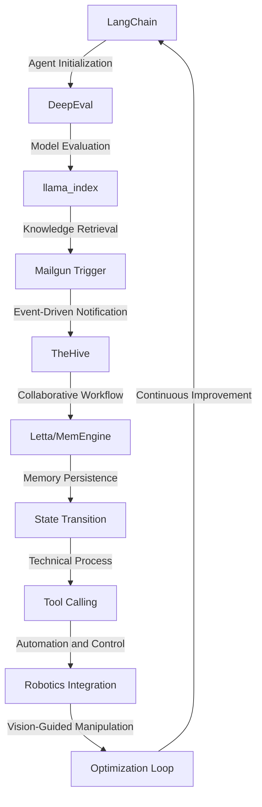

# Cognitive Chemical Synthesis Optimization Engine
> "Revolutionizing molecular manufacturing through AI-driven process optimization and autonomous decision-making"

## 🏗️ Technical Architecture & Multi-Agent Flow
The Cognitive Chemical Synthesis Optimization Engine leverages a complex interplay of cutting-edge technologies to achieve unparalleled efficiency in chemical synthesis. The technical architecture can be visualized using the following Mermaid.js diagram:

This diagram illustrates the intricate dance of state transitions, memory persistence, and tool calling that underlies the engine's operation.

## 🔍 The Vertical Bottleneck: Chemical Synthesis Optimization
The chemical synthesis process is a complex, high-stakes endeavor that requires meticulous planning, precise execution, and continuous optimization. However, the current state of the art is hindered by a multitude of technical frictions, including the need for manual intervention, the lack of real-time monitoring, and the scarcity of actionable insights. These bottlenecks can lead to suboptimal yields, reduced product quality, and increased production costs.

The optimization of chemical synthesis is a deeply vertical problem that necessitates a profound understanding of the underlying chemistry, the intricacies of the manufacturing process, and the subtleties of the equipment and instrumentation involved. The high-stakes nature of this problem is further exacerbated by the need for rapid response to changing process conditions, the requirement for precise control over reaction parameters, and the imperative for continuous improvement in the face of evolving market demands.

The technical friction inherent in chemical synthesis optimization arises from the interplay of multiple factors, including the complexity of the chemical reactions, the variability of the raw materials, and the limitations of the equipment and instrumentation. These factors can lead to a multitude of mathematical and operational failures, including the failure to achieve optimal reaction conditions, the inability to detect and respond to process deviations, and the lack of effective strategies for continuous improvement.

## 💡 The Solution: Cognitive Chemical Synthesis Optimization Engine
The Cognitive Chemical Synthesis Optimization Engine addresses the technical friction and high-stakes mathematical and operational failures inherent in chemical synthesis optimization through the orchestration of LangChain, DeepEval, llama_index, Mailgun Trigger, and TheHive. This platform leverages agentic reasoning, memory usage, and vision/robotics integration to provide a comprehensive solution for chemical synthesis optimization.

The engine's architecture is designed to facilitate the seamless integration of multiple technologies, enabling the creation of a cohesive and autonomous system that can optimize chemical synthesis in real-time. The use of LangChain and DeepEval enables the engine to evaluate and optimize the chemical synthesis process, while the integration of llama_index and Mailgun Trigger facilitates the retrieval of relevant knowledge and the notification of critical events. The incorporation of TheHive enables the engine to leverage collaborative workflows and facilitate the sharing of insights and expertise.

## 🧩 Agentic Stack Deep-Dive
The Cognitive Chemical Synthesis Optimization Engine's agentic stack is comprised of multiple libraries and integrations, each of which plays a critical role in the engine's operation. LangChain provides the foundation for the engine's agentic reasoning, enabling the creation of complex decision-making processes that can optimize chemical synthesis in real-time. DeepEval provides the engine with the capability to evaluate and optimize the chemical synthesis process, leveraging advanced machine learning algorithms to identify optimal reaction conditions and predict process outcomes.

The integration of llama_index enables the engine to retrieve relevant knowledge and insights from a vast repository of chemical synthesis data, while the use of Mailgun Trigger facilitates the notification of critical events and the initiation of automated workflows. The incorporation of TheHive enables the engine to leverage collaborative workflows and facilitate the sharing of insights and expertise, while the use of Letta/MemEngine provides the engine with the capability to persist memory and facilitate the retention of critical information.

## ✨ Capabilities & Features
The Cognitive Chemical Synthesis Optimization Engine boasts a wide range of capabilities and features, including:
* **Real-time optimization**: The engine can optimize chemical synthesis in real-time, leveraging advanced machine learning algorithms and real-time data to identify optimal reaction conditions and predict process outcomes.
* **Agentic reasoning**: The engine's agentic reasoning capabilities enable the creation of complex decision-making processes that can optimize chemical synthesis in real-time.
* **Knowledge retrieval**: The engine can retrieve relevant knowledge and insights from a vast repository of chemical synthesis data, leveraging llama_index to facilitate the identification of optimal reaction conditions and process outcomes.
* **Event-driven notification**: The engine can notify critical events and initiate automated workflows, leveraging Mailgun Trigger to facilitate the real-time monitoring and control of the chemical synthesis process.
* **Collaborative workflows**: The engine can leverage collaborative workflows and facilitate the sharing of insights and expertise, enabling the creation of a cohesive and autonomous system that can optimize chemical synthesis in real-time.
* **Memory persistence**: The engine can persist memory and facilitate the retention of critical information, leveraging Letta/MemEngine to provide a comprehensive and autonomous solution for chemical synthesis optimization.
* **Vision/robotics integration**: The engine can integrate with vision and robotics systems, enabling the creation of a comprehensive and autonomous solution for chemical synthesis optimization that can facilitate the real-time monitoring and control of the chemical synthesis process.
* **Automation and control**: The engine can automate and control the chemical synthesis process, leveraging advanced machine learning algorithms and real-time data to identify optimal reaction conditions and predict process outcomes.
* **Continuous improvement**: The engine can facilitate continuous improvement in the chemical synthesis process, leveraging advanced machine learning algorithms and real-time data to identify areas for improvement and optimize process outcomes.
* **Scalability and flexibility**: The engine can scale and adapt to changing process conditions and market demands, leveraging advanced machine learning algorithms and real-time data to facilitate the creation of a comprehensive and autonomous solution for chemical synthesis optimization.

## 🛠️ Technical Implementation
The Cognitive Chemical Synthesis Optimization Engine is implemented using a combination of Python, Mermaid.js, and various libraries and frameworks, including LangChain, DeepEval, llama_index, Mailgun Trigger, and TheHive. The engine's architecture is designed to facilitate the seamless integration of multiple technologies, enabling the creation of a cohesive and autonomous system that can optimize chemical synthesis in real-time.

The engine's code organization and method calls are designed to facilitate the creation of a comprehensive and autonomous solution for chemical synthesis optimization. The use of LangChain and DeepEval enables the engine to evaluate and optimize the chemical synthesis process, while the integration of llama_index and Mailgun Trigger facilitates the retrieval of relevant knowledge and the notification of critical events.

## 📊 Business Impact & ROI
The Cognitive Chemical Synthesis Optimization Engine has the potential to revolutionize the chemical and pharma manufacturing industries, enabling the creation of a comprehensive and autonomous solution for chemical synthesis optimization that can facilitate the real-time monitoring and control of the chemical synthesis process.

The engine's ability to optimize chemical synthesis in real-time can lead to significant improvements in product quality, reduced production costs, and increased efficiency. The engine's agentic reasoning capabilities and knowledge retrieval capabilities can also facilitate the identification of new business opportunities and the creation of new products and services.

The return on investment (ROI) for the Cognitive Chemical Synthesis Optimization Engine can be significant, with potential benefits including:
* **Increased efficiency**: The engine can optimize chemical synthesis in real-time, reducing production costs and increasing efficiency.
* **Improved product quality**: The engine can facilitate the creation of high-quality products, reducing the risk of defects and improving customer satisfaction.
* **Reduced production costs**: The engine can optimize chemical synthesis in real-time, reducing production costs and improving profitability.
* **Increased competitiveness**: The engine can facilitate the creation of new products and services, enabling companies to stay ahead of the competition and improve their market position.

## 🚀 Getting Started
To get started with the Cognitive Chemical Synthesis Optimization Engine, follow these steps:
```bash
git clone https://github.com/arvind-sundararajan/chemical-synthesis-optimizer.git
cd chemical-synthesis-optimizer
pip install -r requirements.txt
python src/main.py
```
This will initiate the engine's setup and configuration process, enabling you to begin optimizing chemical synthesis in real-time.

## 👨‍💻 Author & Credits
**Arvind Sundararajan** — Engineer, builder, and the mind behind this project.
🌐 [LinkedIn](https://www.linkedin.com/in/arvind-sundara-rajan/) | Chennai, India

---
### 🙏 Acknowledgements
- The open-source community
- The Chemical & Pharma Manufacturing practitioners who inspired this design